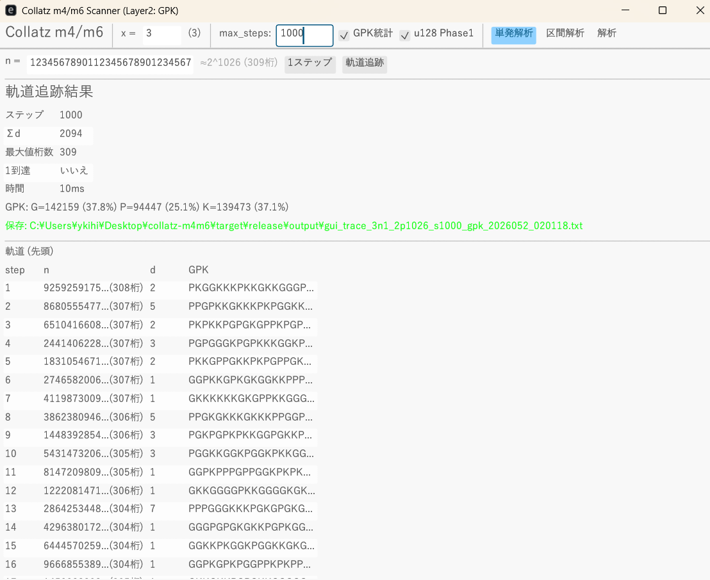
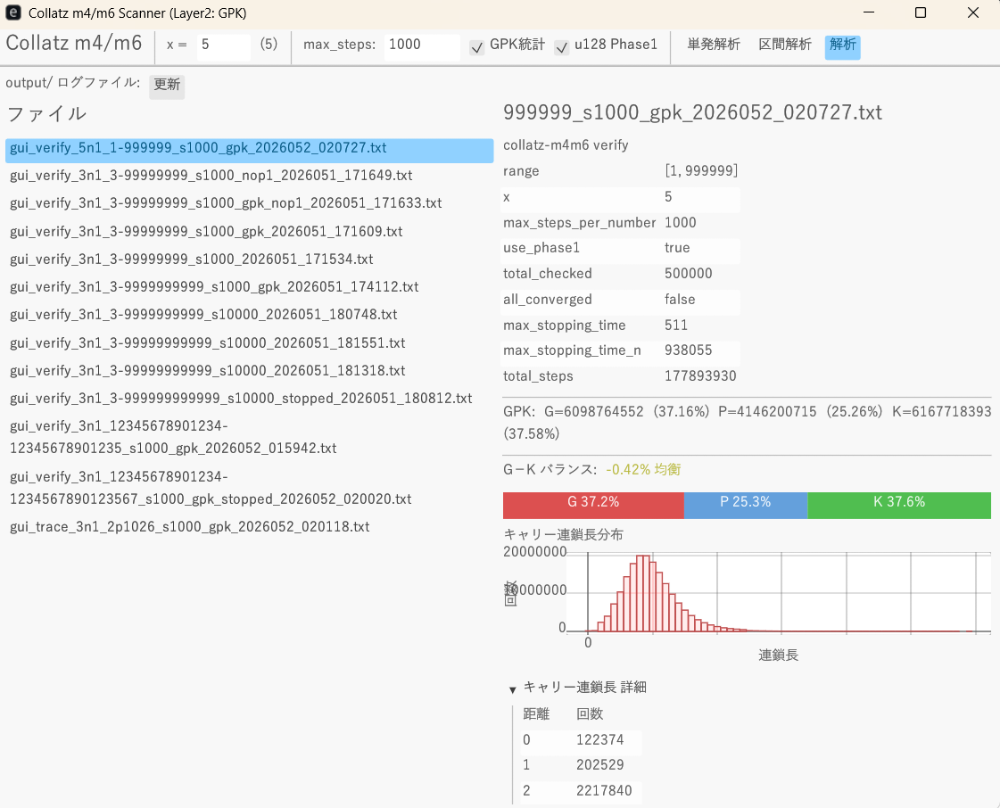

# collatz-m4m6

Pair Predicate Decomposition Tool for Collatz-type Maps $(xn+1)/2^d$

**[Website / Documentation](https://onigirito.github.io/collatz-m4m6/)** | **[Download](https://github.com/onigirito/collatz-m4m6/releases)**

---

## Overview

This tool analyzes Collatz-type maps not as multiplication, but as **carry propagation in an adder circuit** using pair predicate decomposition (m4/m6 basis). It provides:

- **Single Analysis** — Trace a single odd number with full GPK decomposition, d-values, and carry chain lengths
- **Range Analysis (Sweep)** — Verify all odd numbers in a range using parallel threads, with GPK statistics accumulation
- **Log Analysis** — Browse and visualize past verification results

## Key Features

- **GPK Classification**: Each pair position is classified as Generate / Propagate / Kill, revealing the carry structure of the map
- **Carry chain length distribution**: Histogram of how far carries propagate — structural data not available from conventional tools
- **Three-tier computation**: u128 native (Phase 1) → U256 stack (Phase 1.5) → Kogge-Stone packed scan (Phase 2)
- **Sweep capability**: Exhaustive verification of all odd numbers in a range — the same method used in world-record verification

## Verified Results

| Map | Range | Odd numbers | Time | Result |
|-----|-------|-------------|------|--------|
| 3n+1 | 3 ~ 99,999,999,999 (~2^37) | 50 billion | ~2m 17s | All converge (max stopping time 345) |

Measured on Intel Core i7-12650H.

## Paper

**Pair Predicate Decomposition of Collatz-type Maps $(xn+1)/2^d$ and the Structural Closure of $3n+1$**

- [English version](https://onigirito.github.io/collatz-m4m6/collatz_paper_en.html)
- [Japanese version / 日本語版](https://onigirito.github.io/collatz-m4m6/collatz_paper_ja.html)

## Download

**[collatz-gui.exe](https://github.com/onigirito/collatz-m4m6/releases)** (Windows x86_64, ~15 MB, standalone)

SHA-256: `7f9e336cb1704de075923d5609773c1e62f4be7dc9e6a21150f9158aa179dee4`

Requirements: Windows 10/11, OpenGL 2.0

## License

[MIT License](LICENSE) — Free to use, modify, and redistribute.

If you use this software or the accompanying paper in academic publications or commercial products, please [contact me](https://github.com/onigirito).

---

## 概要（日本語）

コラッツ型写像 $(xn+1)/2^d$ を乗算ではなく**加算器のキャリー伝播**として構造的に分解・解析するツールです。

- **単発解析** — 1つの奇数のペア述語分解（GPK列・d値・キャリー連鎖長）
- **区間解析（スイープ）** — 指定範囲の全奇数を並列検証、GPK統計を蓄積
- **解析** — 過去の検証ログの閲覧・可視化

詳細は **[サイト](https://onigirito.github.io/collatz-m4m6/)** をご覧ください。
